# Лабораторная 4. Zookeeper

## Задание
- запустить ZooKeeper,
- изучить директорию с установкой ZooKeeper,
- запустить интерактивную сессию ZooKeeper CLI и освоить её команды,
- научиться проводить мониторинг ZooKeeper,
- разработать приложение с барьерной синхронизацией, основанной на ZooKeeper,
- запустить и проверить работу приложения.

### Установка и запуск
Zookeeper устанавливался на Windows. С помощью zkServer.cmd был запущен сервер

Для запуска интерактивной сессии ZooKeeper CLI используем скрипт zkCli. С помощью команды help изучаем возможности CLi интерфейса.

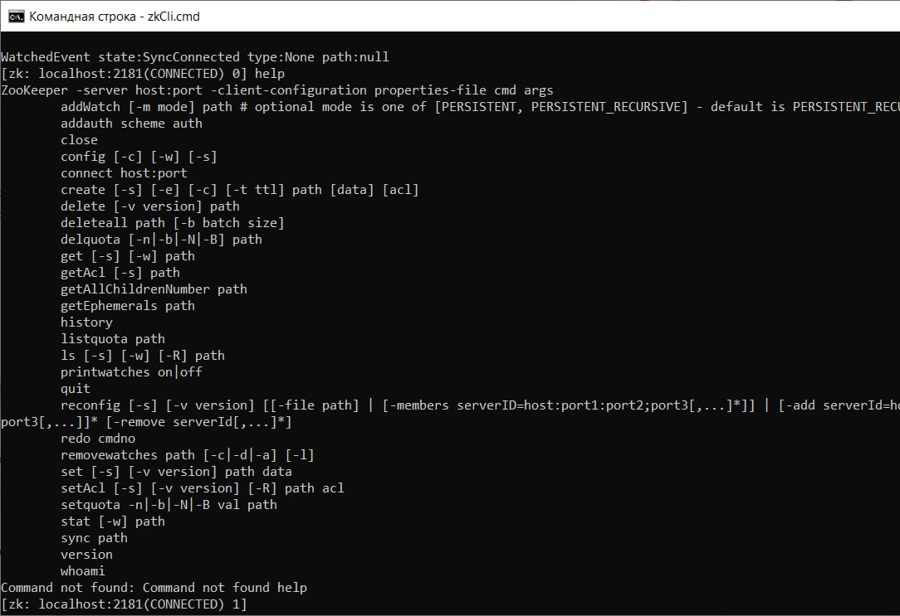

Научимся добавлять и удалять разные типы узлов znode, считывать и записывать данные в znode из CLI, разбираться в управлении конфигурациями на базовых примерах. Находясь в консоли CLI введем команду ls /. В результе получим список узлов в корне иерархической структуры данных ZooKeeper. В данном случае выводится один узел. Аналогично можно изучать некорневые узлы. Выведем список дочерних узлов /zookeeper:

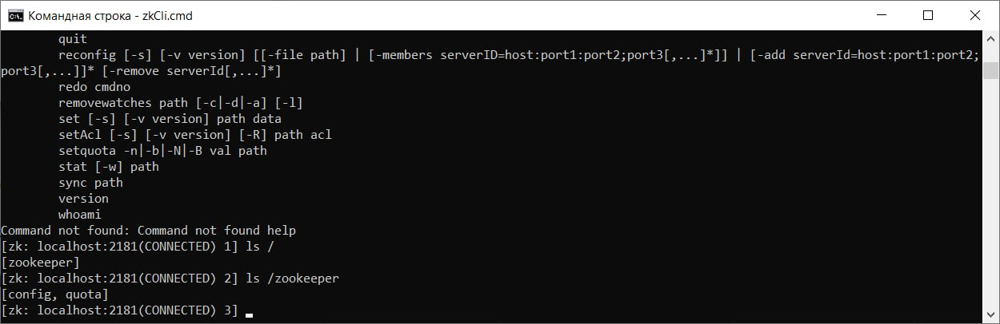

Теперь в корне создадим свой узел /mynode с данными "first_version" и проверим, что в корне появился новый узел.

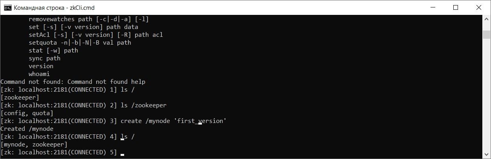

Изменим данные узла на "second_version":

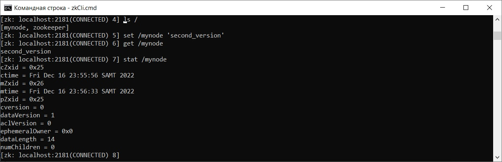

Создадим два нумерованных (sequential) узла в качестве дочерних mynode:

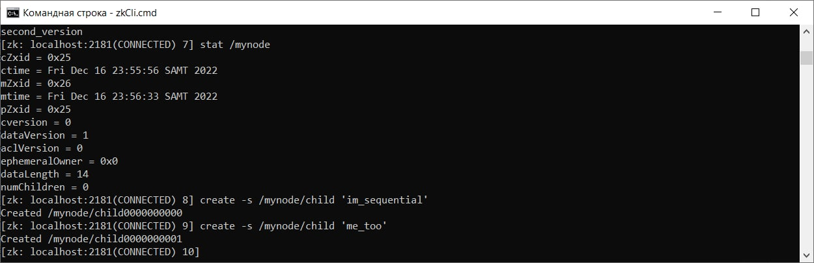

Передав дополнительно флаг -s, мы указали, что создаваемый узел нумерованный. Этот способ позволяет создавать узлы с уникальными именами, по которым можно узнать порядок поступления запросов на сервер.

Пример. Принадлежность клиентов к группе

Несмотря на то, что ZooKeeper используется, как правило, из программного кода, мы можем эмулировать простой сценарий мониторинга принадлежности клиентов к группе в CLI.

В данном примере в корне zookeeper файловой системы будет создан узел под именем mygroup. Затем несколько сессий CLI будут эмулировать клиентов, добавляющих себя в эту группу. Клиент будет добавлять эфимерный узел в mygroup иерархию. При закрытии сессии узел автоматически будет удаляться.

Этот сценарий может применяться для реализации сервиса разрешения имён (DNS) узлов кластера. Каждый узел регистрирует себя под своим именем и сохраняет свой url или ip адрес. Узлы, которые временно недоступны или аварийно завершили работу, в списке отсутствуют. Таким образом директория хранит актуальный список работающих узлов с их адресами.

Внутри CLI сессии, создадим узел mygroup. Откроем две новых CLI консоли и в каждой создайте по дочернему узлу в mygroup и проверим, что grue и bleen являются членами группы mygroup:

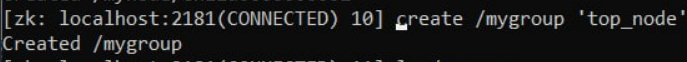
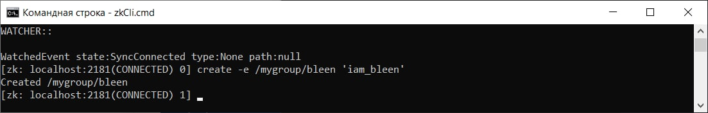
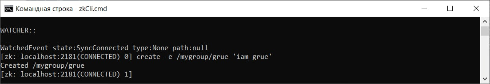
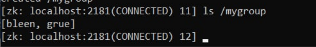

Представим теперь, что одному из клиентов нужна информация о другом клиенте (к качестве клиентов могут выступать узлы кластера). Этот сценарий эмулируется получением информации командой get. Выберем консоль grue и обратимся к информации узла bleen.

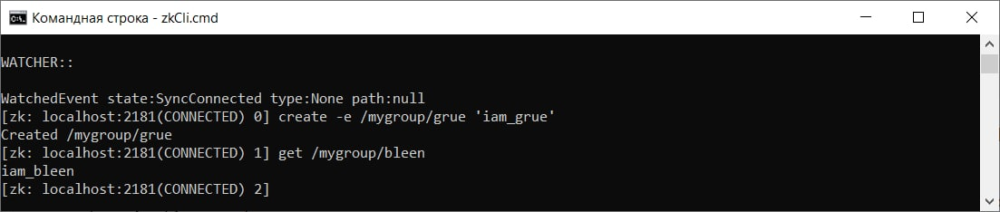

Теперь эмулируем аварийное отключение любого клиента. Нажмем сочетание клавиш Ctrl + D в одной из консолей, создавшей эфимерный узел.
Проверим, что соответствующий узел пропал из mygroup. Изменение списка дочерних узлов может произойти не сразу — от 2 до 20 tickTime, значение которого можно посмотреть в zoo.cfg.

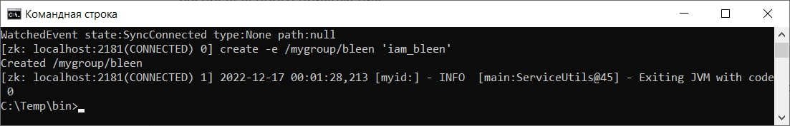
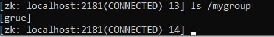

В заключении удалим узел /mygroup.

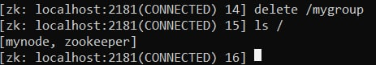

### Animal task
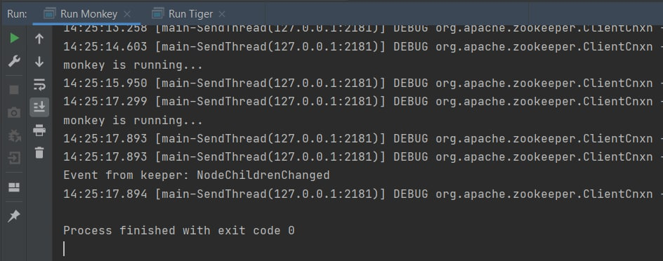
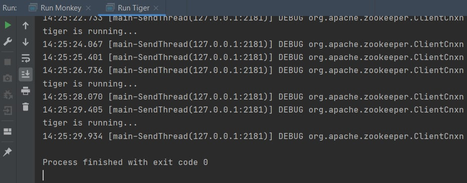

### Philosophers

Результат:
```
Philosopher 0 is going to eat
Philosopher 4 is going to eat
Philosopher 1 is going to eat
Philosopher 2 is going to eat
Philosopher 3 is going to eat
Philosopher 2 picked up the left fork
Philosopher 2 picked up the right fork
Philosopher 5 picked up the left fork
Philosopher 5 picked up the right fork
Philosopher 4 picked up the left fork
Philosopher 5 put the right fork
Philosopher 5 put the loft fork and finished eating
Philosopher 4 picked up the right fork
Philosopher 5 is thinking
Philosopher 1 picked up the left fork
Philosopher 2 put the right fork
Philosopher 2 put the loft fork and finished eating
Philosopher 1 picked up the right fork
Philosopher 3 picked up the left fork
Philosopher 2 is thinking
Philosopher 4 put the right fork
Philosopher 1 put the right fork
Philosopher 1 put the loft fork and finished eating
Philosopher 4 put the loft fork and finished eating
Philosopher 3 picked up the right fork
Philosopher 1 is thinking
Philosopher 4 is thinking
Philosopher 4 is going to eat
Philosopher 5 picked up the left fork
Philosopher 5 picked up the right fork
Philosopher 1 is going to eat
Philosopher 2 picked up the left fork
Philosopher 5 put the right fork
Philosopher 5 put the loft fork and finished eating
Philosopher 1 picked up the left fork
Philosopher 5 is thinking
Philosopher 3 is going to eat
Philosopher 3 put the right fork
Philosopher 3 put the loft fork and finished eating
Philosopher 2 picked up the right fork
Philosopher 3 is thinking
Philosopher 4 picked up the left fork
Philosopher 4 picked up the right fork
Philosopher 2 put the right fork
Philosopher 2 put the loft fork and finished eating
Philosopher 1 picked up the right fork
Philosopher 2 is thinking
Philosopher 2 is going to eat
Philosopher 3 picked up the left fork
Philosopher 1 put the right fork
Philosopher 1 put the loft fork and finished eating
Philosopher 1 is thinking
Philosopher 4 put the right fork
Philosopher 4 put the loft fork and finished eating
Philosopher 3 picked up the right fork
Philosopher 4 is thinking
Philosopher 3 put the right fork
Philosopher 3 put the loft fork and finished eating
Philosopher 3 is thinking
```

### Двуфазный коммит протокол для high-available регистра
Результат:

```
Waiting others clients: []
Client 1 request commit
Client 0 request rollback
Client 2 request rollback
Client 4 request commit
Client 3 request commit
Check clients
Client 0 do commit
Client 1 do commit
Client 2 do commit
Client 3 do commit
Client 4 do commit
Waiting others clients: []
```
